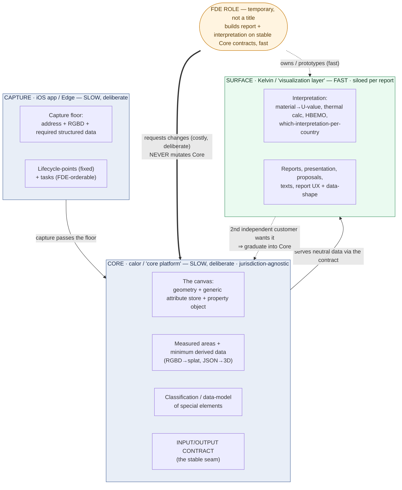

# Outstanding leadership questions — MC + AV answers

> **Read our answers as input, not a mandate:** where we're opinionated on a *solution* it's "our current understanding," weak conviction — push back with cost/feasibility. Tags: `[Firm]` = decided, build against it; `[Input]` = our lean, refine it with us. Throughout, we mean **code/layers, not people** — "Core / Capture / Surface / FDE" are *roles a task sits in*, and **FDE is a temporary role** spanning the operational + downstream layers, not anyone's title.

## Start here — the shared model (new vocabulary, mapped to yours)

The answers use a small shared model from our sessions. It's **new, and we're setting it together** — it's about the code/layers, not people, and it's input, not a mandate. Most of it just renames things you already said:

> **your "core platform" → Core** · **your "visualization layer" → Surface** · **your "forward deploy engineer" → the FDE role**. We add three tier names — **Capture / Core / Surface** — and a few words for the pieces inside them.

**The product as layers — every task lives in one:**

- **Capture (the iOS app / "Edge").** Collects data at the property and verifies it's complete. From a product perspective, it does not need calculation, report logic or the likes, so we only need that if its engineering-wise easier to work on the same logic base.
- **Core** (= your *core platform*; currently: `calor`). Turns captured physical reality into structured data: geometry, **measured areas**, the minimum derived data (RGBD → splat, JSON → 3D model), and the input/output **contract**. Jurisdiction-agnostic — it must not know Danish or French rules, but serves their needs generically.
- **Surface** (= your *visualization layer*; code: Kelvin). Editing, reports, presentation — *and* the jurisdiction **interpretation**. Where report-making lives.

**A few terms the answers use:**

- **The canvas** — the Core's jurisdiction-agnostic data (geometry + a generic attribute store + the property object). The neutral substrate every report is built on.
- **Interpretation** — turning Core's neutral data into a specific report's meaning: material → U-value, thermal/junction calc, HBEMO logic, proposals, texts. Country/customer-specific; lives on the Surface.
- **The FDE role** (= *forward deploy engineer*) — a temporary role, not a title (today: effectively Niels/Martin/Anders). Sits with a customer and builds the report + interpretation on top of stable Core contracts, fast; never mutates Core — it *requests* changes. Why: Core/Capture move slowly and deliberately (costly, everything depends on them); the FDE layer moves fast (prototype daily). Two speeds, on purpose.
- **The capture floor** — the non-negotiable minimum every capture must contain (now: address + RGBD scan + required structured data). Below it, ingestion rejects the capture.
- **Lifecycle-points + tasks** — how the capture flow is configured: fixed points (e.g. scan) that can't move, plus flexible tasks (forms/notes/annotations) the FDE can order/insert.
- **Classification / data-model** — Core says *what* a thing is and *which ways it could be interpreted* ("this is a knee-wall junction; interpretations 1–4 exist"); the FDE picks *which* applies.
- **One-way vs two-way door** — irreversible/costly to undo (be deliberate) vs cheap to undo (just decide).

***

## 3D track

### 1 · Accuracy vs. Smoothness — `[Firm]` agree with your proposed resolution

Agreed: **modularise derived-model generation** so approaches can be iterated/forked; different fidelity per use-case comes later without a platform rethink; no big-bang, no extra cost (it falls out of the internal/external/envelope split — agreed; data lineage TBD in-track). Two refinements to bank:

- **The spine sets the default:** the *internal* model is correct (truth of capture); the *external/derived* model may be smoothed — it's a two-way-door artefact, so the exact reconstruction algo is decided inside the track as a function of near-term product need + your estimates.
- **Watch "locally correct vs. globally correct,"** not "pretty vs. accurate" — that's the axis that actually bites. And note **measured areas are authoritative and computed in Core** (not a smoothing concern); USDZ/visualisation is for rough validation ("is it captured right"), never precise measurement.

### 2 · Edge-case investment — `[Firm]` scope the claim + a measured manual fallback

We don't optimise *derivation/automation* for the rare, complex buildings now — but we capture them greedily (RGBD always; cheap, irreversible) and we support every difficulty level we *claim* via a measured manual fallback, not premature automation. Concretely (decided in session): **accept ~5% of cases going to manual** (the hard tail, cost ∝ complexity), **sold as a paid SLA option** (≈1 day / 300 kr, 2 days / 50 kr — "insurance"), not in base price; revisit the SLA ~every 6 months. So Marina/Anders' "support what we claim" holds (via the human escape-hatch + a scoped, explicit difficulty claim) and Martin's "don't over-invest" holds (no automation spend on the 3% nightmares). **Action:** define the difficulty boundary we claim explicitly — that's the thing to write down, not "support everything."

### 3 · Internal scan fidelity as "reality capture" — `[Firm]` yes, capture reality

Capture the inside as it is — the visit is the one-way door. "Good enough for EPC" governs *derivation*, never *capture*. This is now concrete via Q4: RGBD is the minimum (see below), and for tilstand specifically *"how it looked the day you were there"* is the deliverable — we can't assume it was scanned right, that no time passed, or that nothing changed. With RGBD the answer shifts in our favour: RGBD *is* the reality capture (plus a fallback and a derivation source), so we don't need parametric perfection — parametric becomes an additional derived, re-derivable artefact on top of retained raw. Retention is therefore deliberate.

### 4 · Capturing RGBD / point clouds — `[Firm]` it's the baseline now (changed from "POC-for-LOI")

- **Behind-the-scenes vs. product?** Neither "optional behind-the-scenes" — RGBD is the mandatory minimum capture (address + RGBD, one continuous scan) and part of the tilstand deliverable. So no separate capture *incentive* is needed — it's required to make a Plans survey.
- **End-user surface:** rough verification (USDZ / RGBD frames — "is everything captured"); the splat/reconstruction is a Core derived-data deliverable (after the online roundtrip), not a raw dump to the user.
- **Next 4–6 months:** not just POC-for-LOI — it becomes the capture baseline, justified on tooling merits alone (point cloud → roomformer → roomplan beats roomplan → pointcloud; fallback if our 3D production fails; future-proof). The AI-training-data / robot thesis is a *separate*, bounded downstream option — it doesn't gate or justify the capture, and some RGBD/LLM processing can be delayed until wifi if it serves that angle. *(Honest note: no confirmed third-party scan buyers yet — treat the data sale as an option, not a plan; see the kit appendix.)*

***

## Report track

### A · Enforce a specific/opinionated flow per report? — `[Firm]` yes, with the lifecycle-points model

Yes — opinionated and uniform per report initially (all customers of a report get the same flow). Flexibility is *not* a full configurable flow-engine; it's **lifecycle-points + tasks**: fixed core components (scan, RGBD, roomplan, materials) sit at fixed points; the FDE orders/inserts non-core tasks (Forms, Notes, Fields, annotations) at defined points, above the floor. Modularity grows from there, not from day-one freedom.

### B · Stop custom/bespoke for EPC/Botjek? Where's the line? — `[Firm]` don't stop it, constrain where it lives

Bespoke is allowed as a time-boxed learning tactic, not a permanent line. The line:

- **Generic (Core):** raw capture + structured data + measured areas + the classification/data-model of special elements + the input/output contract + verification. The FDE *consumes* this and *requests* changes; requesting a new core component is deliberately costly.
- **Bespoke-allowed (FDE / interpretation + report layer):** which interpretation per customer/country, material↔catalog binding, supplementary calcs, and report presentation. Customer-specific work lives here, on top of stable Core contracts — never by mutating Core.
- **Graduation:** a 2nd independent customer asking for the same thing graduates it into Core (designed against ≥3 cases). That's the feasible, enforceable line.

### C · Who defines a report's output? When is it "good enough"? — `[Firm]` the report-owner (FDE) + the design partner, iteratively

"Done" is per layer. **Capture-done** = passes the capture floor + on-site verify (Core's standard). **Report-done** = the consumer/regulator standard, defined by the FDE/report-owner with the design partner, iteratively until they adopt it org-wide — plus jurisdiction-calc validation. Core does not define report-done; the FDE/report layer does.

### D · Prototype on prod? FDE fully produces a report? FDE decides UX + data-shape? Siloing? — `[Input → Firm direction]`

Yes to the operating model: FDEs own the report/Surface, prototype fast on stable Core contracts, and silo per report. They decide report UX/UI and report-specific data shaping. The one guardrail: they do **not** decide the Core canvas / contract / canonical data model — they consume it and request changes (see B). So "single-thread per report" is fine *above* the contract; *below* it, things stay deliberate and shared. *("Prototype directly on prod" — directionally yes for the report layer; keep Core robust. Marked *`[Input]`*: tell us if prod-prototyping has costs we're underweighting.)*

### E · Data capture vs. visualisation — what does Core own? — `[Firm]` (the important one)

Your proposed boundary is directionally right, with one correction: "calc" splits. Map each candidate:

| Thing                                                                                        | Owner     | Why                                                                 |
| -------------------------------------------------------------------------------------------- | --------- | ------------------------------------------------------------------- |
| Raw capture, structured data, measured areas (80s→90s→measured)                              | **Core**  | geometric/derived, jurisdiction-agnostic                            |
| Minimum derived data (JSON→3D model, RGBD→splat)                                             | **Core**  | the API's minimum deliverable                                       |
| Classification / data-model of special elements                                              | **Core**  | a broad, cross-country structured model                             |
| HBEMO logic, thermal linear-loss, material↔catalog binding, which-interpretation-per-country | **FDE**   | interpretation, country/customer-specific                           |
| Proposals, texts                                                                             | **FDE**   | report-specific derived content                                     |
| Thermal-envelope *overview*                                                                  | **split** | the envelope geometry/areas = Core; the overview presentation = FDE |

- **Where does visualisation start?** Visualisation = rendering + report-specific shaping = FDE. Derived *data* splits the same way: geometric/measured-area derivations = Core; interpretation-derived (U-values via catalogs, proposals, texts) = FDE.
- **Isolated per report or cohesive?** Report presentation is siloed per report (FDE), but shared concepts — case states, assignees, report status, the canonical *property* object — live in Core, for cross-report cohesion and downstream harmonisation.
- **So the boundary:** capture + structured-data + measured-areas + classification + contract = Core; interpretation + report artefacts (on top) = FDE. Not "all calc = Core."

### F · Scan per home-visit or per case? — `[Firm]` per property; multi-actor reconciliation is `[Open, deferred]`

The scan attaches to the *property*, not the visit/case — the canonical object is the property (`Home`), and multiple cases/surveyors/reports reference the same property. RGBD is always captured. The harder multi-actor case (EL vs tilstand vs EPC visiting the same property — who scans, how edits reconcile) is a known open problem we're deliberately deferring: V1 is "dumb" — bind the RGBD to tilstand (highest coverage), EL is reactive (status-quo digital report), no reconciliation / no multiplayer in V1; match later via room-name / image correspondence. We're minimising dependence on Botjek's CM here. AV + Botjek (Thomas/Lukas) to scope; we'll get EL-without-tilstand frequency data. *(Not blocking — see "On timing.")*

***

## Still open / owned (not blocking the kickoff)

1. **Room-level area + material-override verification** — the *solution* (not just "is it possible"). → AV.
2. **Multi-actor scan reconciliation** — who-scans rule, reconciliation approach, EL-in-3D-path. → defer; AV + Botjek.
3. **Renewals / revisits** — legal definition + add-a-note interface; no-scan ⇒ no supported revisit. → ask Thomas/Lukas.
4. **Q5 input matrix** — native-offline / app-online / both-online / web-only, per task. → MC/AV to draft.

***

## On timing — `[Firm]` the direction is kickoff-ready; estimates come in two passes

The open items above are real, but they are **not blockers for the engineering kickoff**. The direction is firm enough to start both tracks together: 3D and report/forms/metadata should be introduced as one operating model, because the boundary between Capture / Core / Surface is the point.

If we send this on **Tuesday, 2026-06-02**, the concrete ask is:

1. **Start spikes immediately after kickoff.** Use the answers above as the product direction; spikes refine feasibility, data lineage, implementation shape and cost — they do not reopen the basic layer split.
2. **Estimate in two passes.** First: rough estimates from the current direction, enough to expose sequencing and staffing trade-offs. Second: tighter estimates after spike results.
3. **Keep calendar commitments explicit.** Calendar time depends on shared staffing across 3D and reports/forms/metadata. AV + Henrik should confirm the first sequencing proposal before this becomes an external promise.

## What we need back from engineering — `[Input]` push on cost, not direction

Please push back where our product read underweights engineering cost, especially:

- **Data lineage:** internal model → external/derived model → envelope → measured areas → report artefacts.
- **Room-level measured areas + material overrides:** what is the minimum solution we can trust in the field?
- **Core contract shape:** how Core exposes generic classification and how the Surface/FDE layer selects interpretation without mutating Core.
- **Production-safe report prototyping:** what guardrails are needed if report-layer prototypes run on production data or production-adjacent workflows?
- **Offline / online split:** which tasks must be native-offline, app-online, both-online, or web-only?
- **Scan reconciliation:** what V1 assumptions make the deferred multi-actor problem cheap to revisit later?

The main thing we want to avoid is treating every unresolved detail as a reason to delay. Treat the `[Firm]` answers as constraints, treat the `[Input]` answers as our current lean, and tell us where the cost curve says we should adjust.

## The divisions at a glance — roles, made explicit

Same model as the top of the doc, stated as **four divisions** (code/layers + one role), each with a one-line job, what it owns, and its speed. *Remember: layers, not people; FDE is a temporary role.*

- **Capture — the iOS app / "Edge."** *Job:* collect data at the property and verify it's complete against the **capture floor**; no calc/report logic. *Owns:* the capture floor (address + RGBD + required structured data) and the **lifecycle-points** (fixed) + **tasks** (FDE-orderable). *Speed:* **slow/deliberate** — things downstream depend on it.
- **Core —** `calor` **(your "core platform").** *Job:* turn captured physical reality into **structured, jurisdiction-agnostic data** and expose it through a stable contract. *Owns:* the **canvas** (geometry + generic attribute store + the canonical *property* object), **measured areas**, minimum derived data (RGBD→splat, JSON→3D), **classification/data-model** of special elements, shared case state, and the **input/output contract**. *Must not know* Danish/French rules. *Speed:* **slow/deliberate, costly to change.** Defines **capture-done**, never report-done.
- **Surface — Kelvin (your "visualization layer").** *Job:* editing, reports, presentation **and** jurisdiction **interpretation** — where report-making lives. *Owns:* report UX/UI, report-specific data shaping, presentation. *Speed:* **fast.** Siloed per report.
- **FDE role — forward deploy engineer (temporary role, not a title; today ≈ Niels/Martin/Anders).** *Job:* sit with a customer and build the **report + interpretation** on top of **stable Core contracts**, fast. *Owns:* which interpretation per customer/country, material↔catalog binding, supplementary calcs, proposals/texts, and **report-done** (with the design partner). *Hard rule:* **consumes Core, never mutates it — it** ***requests*** **changes** (deliberately costly). *Speed:* **fast — prototype daily.**

**The boundary in one line:** capture + structured-data + measured-areas + classification + contract = **Core (generic, slow)**; interpretation + report artefacts on top = **FDE/Surface (bespoke, fast)**. A 2nd independent customer asking for the same thing **graduates** it into Core.

***
